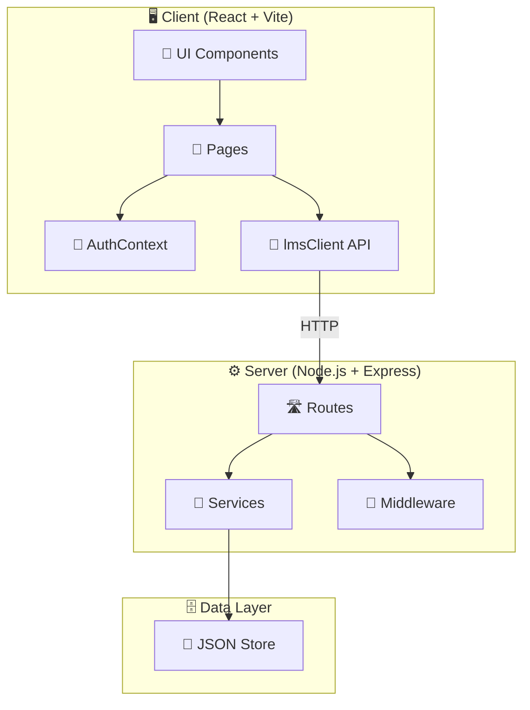
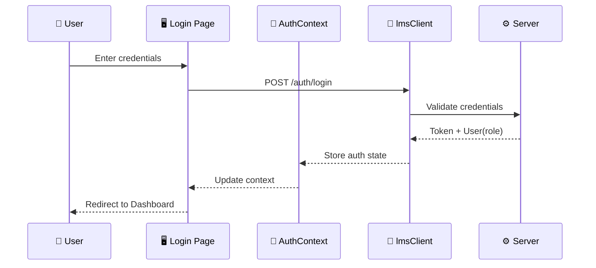
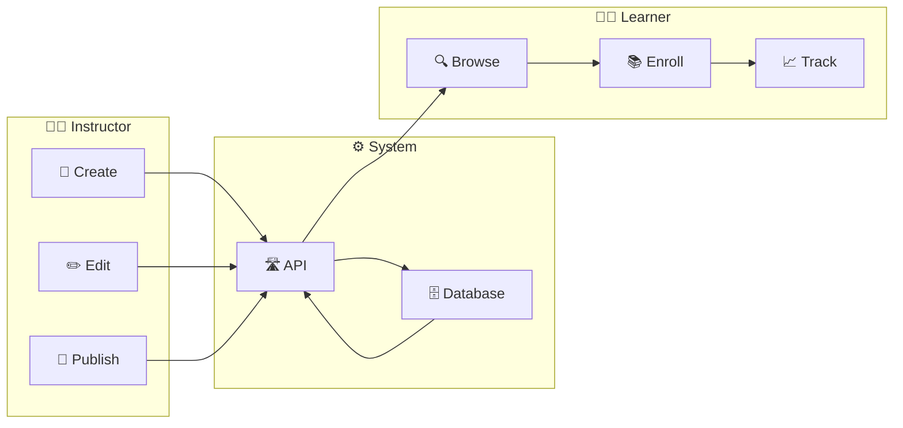
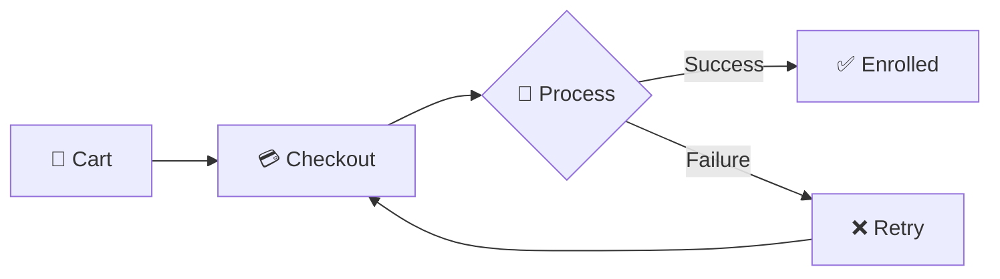

<div align="center">

## ✨ Aurora LMS ✨

### A Modern Learning Management System

<p>
  
  
  
  
  
</p>

<p>
A lightweight full-stack LMS demo with role-based dashboards, course lifecycle management, mock payments, timelines, and notifications.
</p>

[Features](#-features) • [Tech Stack](#-tech-stack) • [Installation](#-installation) • [Project Structure](#-project-structure) • [Workflows](#-workflows) • [API](#-api-reference)

</div>

---

## 📑 Table of Contents

- [Features](#-features)
- [Tech Stack](#-tech-stack)
- [Installation](#-installation)
- [Project Structure](#-project-structure)
- [Architecture](#-architecture)
- [Workflows](#-workflows)
- [API Reference](#-api-reference)

---

## 🚀 Features

<table>
<tr>
<td width="50%">

### 👤 Role-Based Dashboards
```
┌─────────────────────────────────┐
│         🔐 LOGIN                │
└───────────┬─────────────────────┘
            │
    ┌───────┼───────┐
    ▼       ▼       ▼
┌───────┐┌───────┐┌───────┐
│ ADMIN ││INSTRUC││LEARNER│
│  📊   ││  📚   ││  📖   │
└───────┘└───────┘└───────┘
```
- **Admin**: System overview, user management, analytics
- **Instructor**: Course creation, material uploads, learner tracking
- **Learner**: Course enrollment, progress tracking, materials access

</td>
<td width="50%">

### 📚 Course Lifecycle
```
┌────────┐   ┌─────────┐   ┌────────┐
│ CREATE │──▶│ PUBLISH │──▶│ ENROLL │
└────────┘   └─────────┘   └────────┘
                               │
┌────────┐   ┌─────────┐       │
│ARCHIVE │◀──│ TRACK   │◀──────┘
└────────┘   └─────────┘
```
- Full course management workflow
- Progress tracking & milestones
- Material organization

</td>
</tr>
<tr>
<td width="50%">

### 💳 Mock Payment System
```
┌──────────┐    ┌──────────┐    ┌──────────┐
│  CART    │───▶│ CHECKOUT │───▶│ CONFIRM  │
│  🛒      │    │  💳      │    │  ✅      │
└──────────┘    └──────────┘    └──────────┘
```
- Simulated payment flow
- Success/failure handling
- Enrollment confirmation

</td>
<td width="50%">

### 🔔 Notifications & Timeline
```
┌─────────────────────────────────┐
│ 🔔 Notification Banner          │
├─────────────────────────────────┤
│ ● ─────●─────●─────●───▶ 📅    │
│   Event Timeline                │
└─────────────────────────────────┘
```
- Real-time notification banners
- Visual course event timeline
- Milestone tracking

</td>
</tr>
</table>

### ✨ Visual Components

| Component | Description | Preview |
|-----------|-------------|---------|
| 🌌 **AuroraBackground** | Animated decorative background | Gradient animations |
| 📊 **StatGlint** | KPI cards with micro-animations | Sparkle effects |
| 📁 **CourseMaterialsModal** | Document/media viewer | Modal overlay |
| 📢 **NotificationBanner** | System-wide alerts | Top banner |
| 📅 **Timeline** | Course event visualization | Horizontal timeline |

---

## 🛠 Tech Stack

<table>
<tr>
<td align="center" width="33%">

### Frontend
```
┌─────────────────┐
│     React       │
│    ┌─────┐      │
│    │Vite │      │
│    └─────┘      │
│  Tailwind CSS   │
│     ESLint      │
└─────────────────┘
```

</td>
<td align="center" width="33%">

### Backend
```
┌─────────────────┐
│    Node.js      │
│    ┌─────┐      │
│    │Express│    │
│    └─────┘      │
│   REST API      │
│   Middleware    │
└─────────────────┘
```

</td>
<td align="center" width="33%">

### Data
```
┌─────────────────┐
│   JSON Store    │
│    ┌─────┐      │
│    │ DB  │      │
│    └─────┘      │
│  Persistence    │
│   (Demo Mode)   │
└─────────────────┘
```

</td>
</tr>
</table>

| Layer | Technology | Purpose |
|-------|------------|---------|
| **UI** | React 18 | Component-based UI |
| **Bundler** | Vite | Fast dev server & build |
| **Styling** | Tailwind CSS | Utility-first CSS |
| **Server** | Express.js | REST API server |
| **Runtime** | Node.js | JavaScript runtime |
| **Data** | JSON file | Demo persistence |

---

## 📦 Installation

### Prerequisites
- Node.js >= 18
- npm or yarn

### Quick Start

```bash
# 1️⃣ Clone the repository
git clone https://github.com/your-username/aurora-lms.git
cd aurora-lms

# 2️⃣ Install dependencies
cd client && npm install
cd ../server && npm install

# 3️⃣ Start development servers (in separate terminals)

# Terminal 1 - Frontend
cd client && npm run dev

# Terminal 2 - Backend
cd server && npm run dev
```

```
┌─────────────────────────────────────────────────────────┐
│  🖥️  Frontend: http://localhost:5173                    │
│  🔧 Backend:  http://localhost:3000                    │
└─────────────────────────────────────────────────────────┘
```

---

## 📁 Project Structure

```
aurora-lms/
│
├── 📂 client/                    # React Frontend
│   ├── 📂 public/                # Static assets
│   ├── 📂 src/
│   │   ├── 📂 api/
│   │   │   └── 📄 lmsClient.js   # API wrapper
│   │   ├── 📂 components/
│   │   │   ├── 🎨 AuroraBackground.jsx
│   │   │   ├── 📁 CourseMaterialsModal.jsx
│   │   │   ├── 🔔 NotificationBanner.jsx
│   │   │   ├── ✨ StatGlint.jsx
│   │   │   └── 📅 Timeline.jsx
│   │   ├── 📂 context/
│   │   │   └── 🔐 AuthContext.jsx
│   │   ├── 📂 pages/
│   │   │   ├── 📊 AdminDashboard.jsx
│   │   │   ├── 👨‍🏫 InstructorDashboard.jsx
│   │   │   ├── 👨‍🎓 LearnerDashboard.jsx
│   │   │   └── 🔑 Login.jsx
│   │   ├── 📄 App.jsx
│   │   └── 📄 main.jsx
│   └── 📄 package.json
│
├── 📂 server/                    # Express Backend
│   ├── 📂 data/
│   │   └── 🗄️ aurora-db.json     # JSON database
│   ├── 📂 src/
│   │   ├── 📂 routes/
│   │   │   ├── 🛡️ adminRoutes.js
│   │   │   ├── 🔐 authRoutes.js
│   │   │   ├── 💳 bankRoutes.js
│   │   │   ├── 📚 coursesRoutes.js
│   │   │   ├── 👨‍🏫 instructorsRoutes.js
│   │   │   └── 👨‍🎓 learnersRoutes.js
│   │   ├── 📂 services/
│   │   │   ├── adminService.js
│   │   │   ├── authService.js
│   │   │   ├── bankService.js
│   │   │   ├── instructorService.js
│   │   │   └── learnerService.js
│   │   ├── 📂 middleware/
│   │   │   └── errorHandlers.js
│   │   └── 📄 index.js
│   └── 📄 package.json
│
├── 📂 docs/                      # Documentation
│   ├── 📄 architecture.md
│   └── 📄 code-map.md
│
└── 📄 README.md
```

---

## 🏗 Architecture



### Component Interaction

```
┌──────────────────────────────────────────────────────────────────┐
│                        CLIENT (Browser)                          │
├──────────────────────────────────────────────────────────────────┤
│  ┌────────────┐  ┌────────────┐  ┌────────────┐  ┌────────────┐ │
│  │   Login    │  │   Admin    │  │ Instructor │  │  Learner   │ │
│  │   Page     │  │ Dashboard  │  │ Dashboard  │  │ Dashboard  │ │
│  └─────┬──────┘  └─────┬──────┘  └─────┬──────┘  └─────┬──────┘ │
│        │               │               │               │        │
│        └───────────────┴───────┬───────┴───────────────┘        │
│                                │                                 │
│                    ┌───────────▼───────────┐                    │
│                    │     AuthContext       │                    │
│                    │  (State Management)   │                    │
│                    └───────────┬───────────┘                    │
│                                │                                 │
│                    ┌───────────▼───────────┐                    │
│                    │     lmsClient API     │                    │
│                    │    (HTTP Requests)    │                    │
│                    └───────────┬───────────┘                    │
└────────────────────────────────┼────────────────────────────────┘
                                 │ HTTP
┌────────────────────────────────▼────────────────────────────────┐
│                        SERVER (Express)                          │
├──────────────────────────────────────────────────────────────────┤
│  ┌──────────────────────────────────────────────────────────┐   │
│  │                      Routes Layer                         │   │
│  │  ┌──────┐ ┌──────┐ ┌──────┐ ┌──────┐ ┌──────┐ ┌──────┐  │   │
│  │  │ Auth │ │Admin │ │Course│ │Instr │ │Learn │ │ Bank │  │   │
│  │  └──┬───┘ └──┬───┘ └──┬───┘ └──┬───┘ └──┬───┘ └──┬───┘  │   │
│  └─────┼────────┼────────┼────────┼────────┼────────┼───────┘   │
│        └────────┴────────┴───┬────┴────────┴────────┘           │
│                              │                                   │
│  ┌───────────────────────────▼───────────────────────────────┐  │
│  │                    Services Layer                          │  │
│  │  (authService, adminService, instructorService, etc.)     │  │
│  └───────────────────────────┬───────────────────────────────┘  │
│                              │                                   │
│  ┌───────────────────────────▼───────────────────────────────┐  │
│  │                    Data Layer                              │  │
│  │                  aurora-db.json                            │  │
│  └────────────────────────────────────────────────────────────┘  │
└──────────────────────────────────────────────────────────────────┘
```

---

## 🔄 Workflows

### 1️⃣ Authentication Flow



```
┌─────────────────────────────────────────────────────────────┐
│                    AUTHENTICATION FLOW                       │
├─────────────────────────────────────────────────────────────┤
│                                                              │
│   👤 User          🖥️ Frontend         ⚙️ Backend           │
│      │                  │                  │                 │
│      │ ─── Login ──────▶│                  │                 │
│      │                  │ ── POST /auth ──▶│                 │
│      │                  │                  │                 │
│      │                  │◀── Token+Role ───│                 │
│      │◀── Dashboard ────│                  │                 │
│      │                  │                  │                 │
│      │    ┌─────────────┴──────────────┐   │                 │
│      │    │   Role-based Redirect      │   │                 │
│      │    │  ┌────────┬────────┬─────┐ │   │                 │
│      │    │  │ Admin  │ Instr  │Learn│ │   │                 │
│      │    │  │   📊   │   👨‍🏫   │  👨‍🎓 │ │   │                 │
│      │    │  └────────┴────────┴─────┘ │   │                 │
│      │    └────────────────────────────┘   │                 │
│                                                              │
└─────────────────────────────────────────────────────────────┘
```

### 2️⃣ Course Management Flow



```
┌─────────────────────────────────────────────────────────────┐
│                   COURSE LIFECYCLE                           │
├─────────────────────────────────────────────────────────────┤
│                                                              │
│  ┌────────┐    ┌────────┐    ┌────────┐    ┌────────┐       │
│  │ CREATE │───▶│  EDIT  │───▶│PUBLISH │───▶│CATALOG │       │
│  │   📝   │    │   ✏️   │    │   📢   │    │   📋   │       │
│  └────────┘    └────────┘    └────────┘    └───┬────┘       │
│       │                                        │             │
│       │              👨‍🏫 INSTRUCTOR              │             │
│       │─────────────────────────────────────────│             │
│                                                 │             │
│       │              👨‍🎓 LEARNER                 │             │
│       │─────────────────────────────────────────│             │
│       │                                        │             │
│       ▼                                        ▼             │
│  ┌────────┐    ┌────────┐    ┌────────┐    ┌────────┐       │
│  │COMPLETE│◀───│ TRACK  │◀───│ LEARN  │◀───│ ENROLL │       │
│  │   🎓   │    │   📈   │    │   📖   │    │   ✅   │       │
│  └────────┘    └────────┘    └────────┘    └────────┘       │
│                                                              │
└─────────────────────────────────────────────────────────────┘
```

### 3️⃣ Payment Flow (Mock)



```
┌─────────────────────────────────────────────────────────────┐
│                     PAYMENT FLOW                             │
├─────────────────────────────────────────────────────────────┤
│                                                              │
│     🛒 CART          💳 CHECKOUT        🏦 PROCESS          │
│    ┌──────┐          ┌──────┐          ┌──────┐             │
│    │      │ ────────▶│      │ ────────▶│      │             │
│    │ $$$  │          │ Pay  │          │ Bank │             │
│    │      │          │      │          │      │             │
│    └──────┘          └──────┘          └──┬───┘             │
│                                           │                  │
│                          ┌────────────────┼────────────────┐│
│                          │                │                ││
│                          ▼                ▼                ││
│                     ┌────────┐       ┌────────┐            ││
│                     │   ✅   │       │   ❌   │            ││
│                     │SUCCESS │       │ FAILED │            ││
│                     └───┬────┘       └───┬────┘            ││
│                         │                │                  ││
│                         ▼                ▼                  ││
│                  ┌──────────┐      ┌──────────┐            ││
│                  │ ENROLLED │      │  RETRY   │            ││
│                  └──────────┘      └──────────┘            ││
│                                                              │
└─────────────────────────────────────────────────────────────┘
```

---

## 📡 API Reference

### Endpoints Overview

```
┌─────────────────────────────────────────────────────────────┐
│                     API ENDPOINTS                            │
├──────────────┬──────────────────────────────────────────────┤
│   🔐 AUTH    │  POST /auth/login                            │
│              │  POST /auth/register                         │
├──────────────┼──────────────────────────────────────────────┤
│   📚 COURSES │  GET  /courses                               │
│              │  POST /courses                               │
│              │  GET  /courses/:id                           │
│              │  POST /courses/:id/enroll                    │
├──────────────┼──────────────────────────────────────────────┤
│   💳 BANK    │  POST /bank/charge                           │
├──────────────┼──────────────────────────────────────────────┤
│   🛡️ ADMIN   │  GET  /admin/stats                           │
│              │  POST /admin/users                           │
├──────────────┼──────────────────────────────────────────────┤
│ 👨‍🏫 INSTRUCT │  GET  /instructors/courses                   │
│              │  POST /instructors/materials                 │
├──────────────┼──────────────────────────────────────────────┤
│  👨‍🎓 LEARNER │  GET  /learners/enrolled                     │
│              │  GET  /learners/progress                     │
└──────────────┴──────────────────────────────────────────────┘
```

### Request/Response Examples

<details>
<summary><b>🔐 POST /auth/login</b></summary>

**Request:**
```json
{
  "email": "user@example.com",
  "password": "password123"
}
```

**Response:**
```json
{
  "token": "eyJhbGciOiJIUzI1NiIs...",
  "user": {
    "id": "1",
    "name": "John Doe",
    "role": "learner"
  }
}
```
</details>

<details>
<summary><b>📚 GET /courses</b></summary>

**Response:**
```json
{
  "courses": [
    {
      "id": "c1",
      "title": "Introduction to React",
      "instructor": "Jane Smith",
      "price": 49.99,
      "enrolled": 150
    }
  ]
}
```
</details>

---

